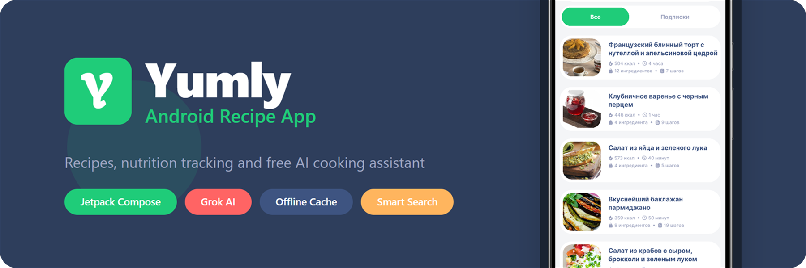
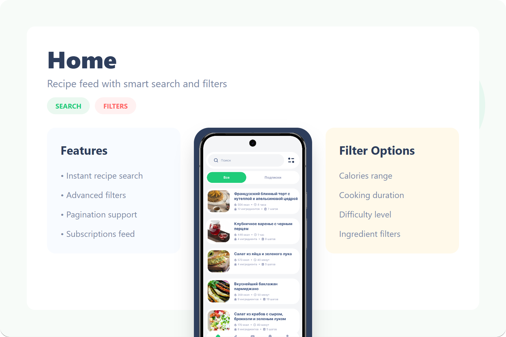
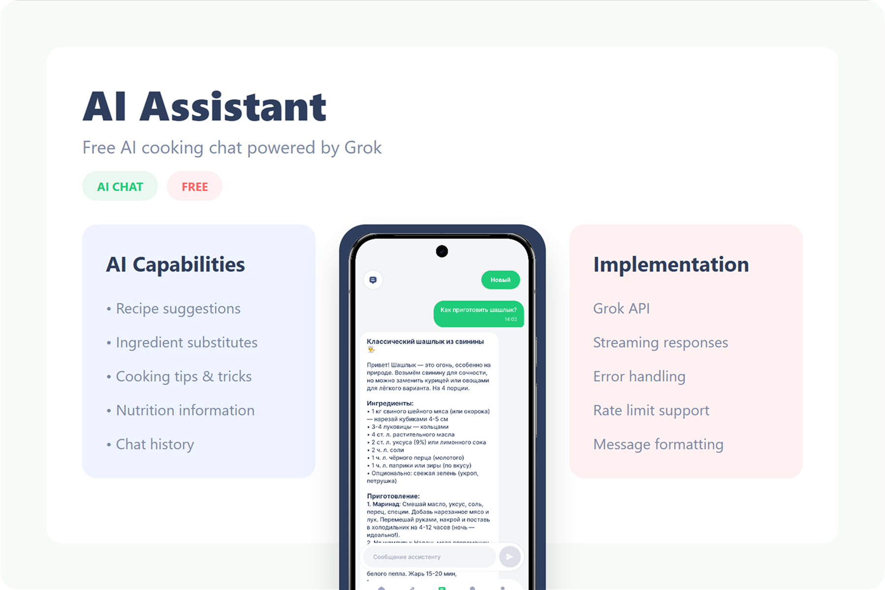
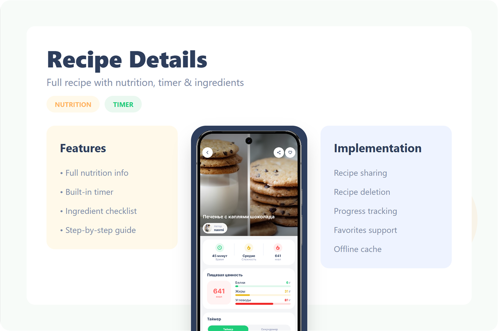
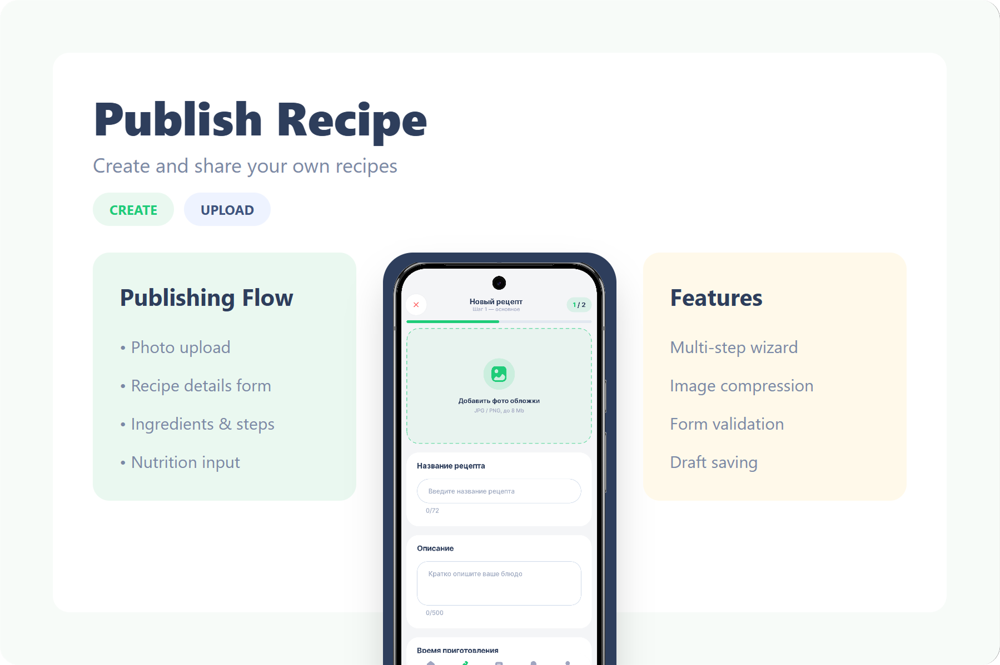
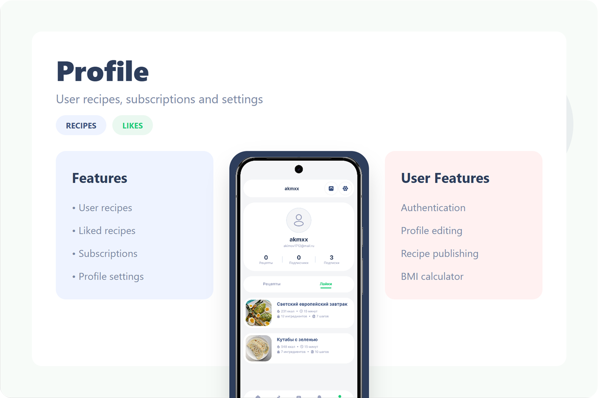

# Yumly

<p align="center">
  
</p>

<p align="center">
  <strong>Yumly</strong> is an Android recipe app with smart discovery, recipe publishing, a personal profile, and a free built-in AI assistant for quick cooking help.
</p>

<p align="center">
  
  
  
  
</p>

## About the Project

**Yumly** is not just a recipe browser. It is designed as a full product flow around cooking content:

- discover recipes through search, filters, and categories;
- open a detailed recipe screen with a timer, nutrition facts, and step-by-step cooking;
- save favorites and use cached content for offline scenarios;
- publish your own recipes through a guided creation flow;
- chat with a built-in **AI assistant** directly inside the app;
- manage a profile, followers, notifications, and personal settings;
- calculate **BMI** and get basic calorie guidance.

## Store

- RuStore: [Yumly](https://www.rustore.ru/catalog/app/ru.topbun.yumly)

## Screen Previews

| Home |
| --- |
|  |
| Recipe feed with search, scenario switches, and filters by cooking time, calories, and difficulty. |

| AI Assistant |
| --- |
|  |
| Free built-in AI chat with conversation history, quick new chat creation, and message limits. |

| Recipe Details |
| --- |
|  |
| Full recipe view with cover image, author, tags, nutrition facts, ingredients, steps, timer, sharing, and favorites. |

| Recipe Publishing |
| --- |
|  |
| Two-step recipe builder for basic info, image, ingredients, steps, tags, and final publishing. |

| Profile and Personalization |
| --- |
|  |
| User profile with recipes, likes, followers, settings, legal documents, and BMI calculator access. |

## Features

### 1. Smart Recipe Feed

- recipe search;
- multiple search modes;
- filtering by category, cooking time, calories, and difficulty;
- pagination, pull-to-refresh, and loading states.

### 2. Full Recipe Experience

- hero recipe section;
- quick recipe stats;
- full nutrition info;
- ingredient checklist with progress;
- step-by-step cooking flow;
- built-in kitchen timer with finish sound;
- favorites, recipe sharing, and own recipe deletion.

### 3. Free AI Assistant

- dedicated tab inside the app;
- chat history;
- new conversation creation;
- formatted messages;
- loading, error, and message limit states.

### 4. Recipe Publishing

- dish image upload;
- title, description, and cooking duration;
- difficulty level;
- ingredient list;
- step-by-step instructions;
- nutrition values and tags;
- success confirmation with navigation to the published recipe.

### 5. Profile and Social Features

- my recipes and liked recipes;
- followers and following;
- profile and avatar editing;
- user settings;
- sign out;
- access to privacy policy and user agreement.

### 6. Additional Flows

- onboarding and welcome flow;
- login, registration, confirmation, and password reset;
- push notifications;
- notification screen with navigation to profiles and recipes;
- BMI calculator with weight range and calorie recommendations.

## Screen Overview

- **Splash**: startup screen that prepares the app state before routing to the main or auth flow.
- **Welcome / Onboarding**: first-run introduction screen with product highlights and quick entry points.
- **Auth Welcome**: entry screen for the authorization flow with navigation to sign in and sign up.
- **Login**: user sign-in form for existing accounts.
- **Register**: account creation screen for new users.
- **Confirm Account**: confirmation code screen used to verify registration.
- **Reset Password Request**: screen for requesting a password reset code.
- **Reset Password**: form for setting a new password after verification.
- **Dashboard**: root container for the main in-app navigation and tab structure.
- **Home**: main feed with search, recipe lists, and access to filters.
- **Home Filter**: dedicated filtering flow for refining recipe search results.
- **Recipe Details**: full recipe page with offline cache banner, ingredients, steps, timer, and actions.
- **Recipe Publishing**: recipe creation flow split into basic data and content sections.
- **AI Assistant**: cooking-focused AI chat available from bottom navigation.
- **Notifications**: list of user and recipe-related notifications.
- **Profile**: personal user area with recipes, likes, counters, and entry points to related screens.
- **Profile Followers**: followers/following screen for social connections.
- **Profile Settings**: profile editing screen for avatar and user name updates.
- **BMI Calculator**: health utility screen for BMI and calorie estimation.

## Technologies and Libraries

| Category | Stack |
| --- | --- |
| Language and platform | `Kotlin`, `Android`, `minSdk 26`, `targetSdk 36`, `JDK 17` |
| UI | `Jetpack Compose`, `Material 3`, `Coil 3`, `compose-shimmer`, `datepicker`, `reorderable` |
| Navigation | `Voyager` |
| Architecture | modular structure, `MVI`, `State + Intent + Event`, `Clean Architecture` |
| DI | `Koin` |
| Data layer | `Retrofit`, `OkHttp`, `Gson`, `Room`, `DataStore Preferences`, `Security Crypto` |
| Integrations | `Firebase Messaging`, `Firebase Analytics`, `AppMetrica`, `RuStore Review` |
| Tooling | `AGP 8.13.2`, `KSP`, `libs.versions.toml` |

## Project Architecture

```text
app/                  entry point, DI graph, root navigation
navigation/           screen providers and navigation contracts
domain/               entities, repository interfaces, use cases, validators
data/                 remote api, local db/cache, datastore, repository impl
core/common/          result models, validators, shared errors
core/android/         base MVI, browser, internet, snackbar helpers
core/ui/              design system, theme, reusable Compose components
feature/*             isolated feature modules for every screen flow
```

### Implemented Feature Modules

- `feature:auth`
- `feature:auth_welcome`
- `feature:auth_login`
- `feature:auth_register`
- `feature:auth_confirm`
- `feature:auth_reset_request`
- `feature:auth_reset`
- `feature:splash`
- `feature:dashboard`
- `feature:home`
- `feature:home_filter`
- `feature:upload`
- `feature:assistant`
- `feature:notification`
- `feature:profile`
- `feature:profile_settings`
- `feature:profile_followers`
- `feature:recipe`
- `feature:bmi`

## Implementation Highlights

- bottom navigation is built around dedicated tabs: `Home`, `Upload`, `Assistant`, `Notification`, `Profile`;
- AI features are separated into a dedicated `gpt` layer inside `data` and `domain`;
- favorites and history rely on a local persistence layer;
- recipe screens support offline scenarios and visual cache state banners;
- the project is already prepared for analytics, push notifications, and external product integrations.

## Quick Start

```powershell
git clone <repo-url>
cd Yumly
.\gradlew assembleDebug
```

### Local Build Requirements

The project expects the following configuration:

- `BASE_URL` in `gradle.properties`;
- `METRICA_KEY` in `gradle.properties`;
- `app/google-services.json` for Firebase integrations.

Once configured, you can run:

```powershell
.\gradlew assembleDebug
.\gradlew test
```

## Use Cases

**Yumly** works well as a base for:

- an Android developer portfolio project;
- a modular Compose architecture showcase;
- a pet project or MVP for a recipe app with AI features;
- further expansion toward meal planning, shopping lists, premium AI, and recommendation systems.

## Summary

Yumly is more than a recipe list. It is a product-ready Android foundation that combines content, AI, publishing flows, social scenarios, offline cache, notifications, and modular architecture in one project.

## License

```text
MIT License

Copyright (c) 2026 akimov1712

Permission is hereby granted, free of charge, to any person obtaining a copy
of this software and associated documentation files (the "Software"), to deal
in the Software without restriction, including without limitation the rights
to use, copy, modify, merge, publish, distribute, sublicense, and/or sell
copies of the Software, and to permit persons to whom the Software is
furnished to do so, subject to the following conditions:

The above copyright notice and this permission notice shall be included in all
copies or substantial portions of the Software.

THE SOFTWARE IS PROVIDED "AS IS", WITHOUT WARRANTY OF ANY KIND, EXPRESS OR
IMPLIED, INCLUDING BUT NOT LIMITED TO THE WARRANTIES OF MERCHANTABILITY,
FITNESS FOR A PARTICULAR PURPOSE AND NONINFRINGEMENT. IN NO EVENT SHALL THE
AUTHORS OR COPYRIGHT HOLDERS BE LIABLE FOR ANY CLAIM, DAMAGES OR OTHER
LIABILITY, WHETHER IN AN ACTION OF CONTRACT, TORT OR OTHERWISE, ARISING FROM,
OUT OF OR IN CONNECTION WITH THE SOFTWARE OR THE USE OR OTHER DEALINGS IN THE
SOFTWARE.
```
